# UserNexus

A React application for managing users created by Husain Jafri.

### screenshots
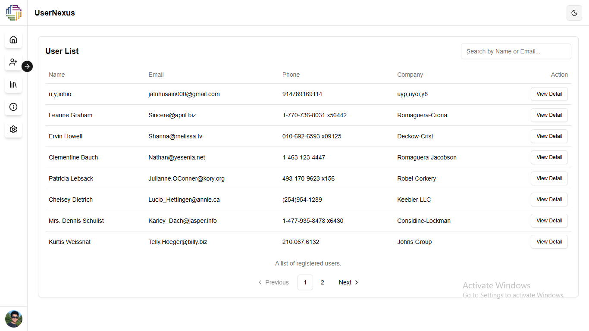
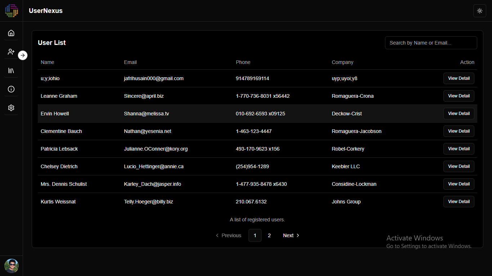
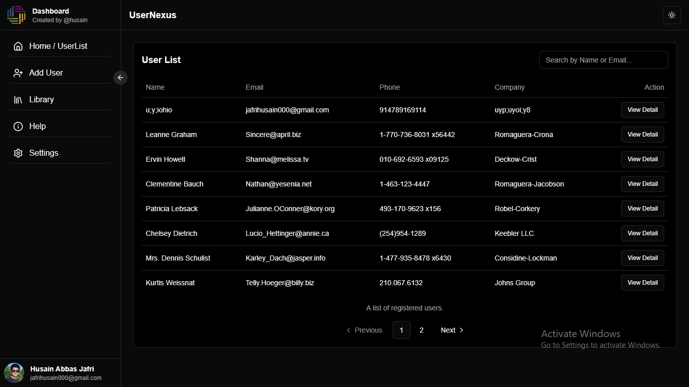
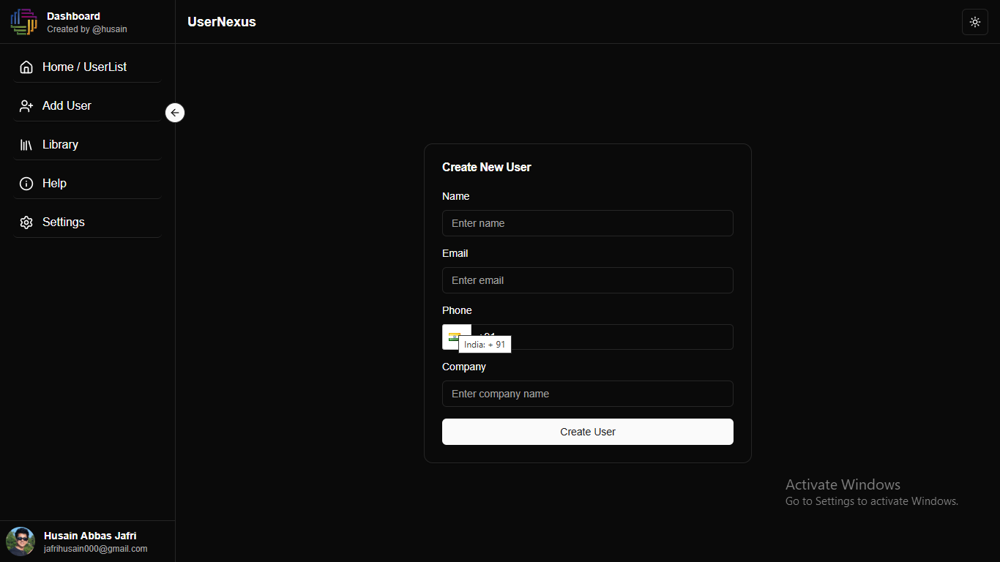
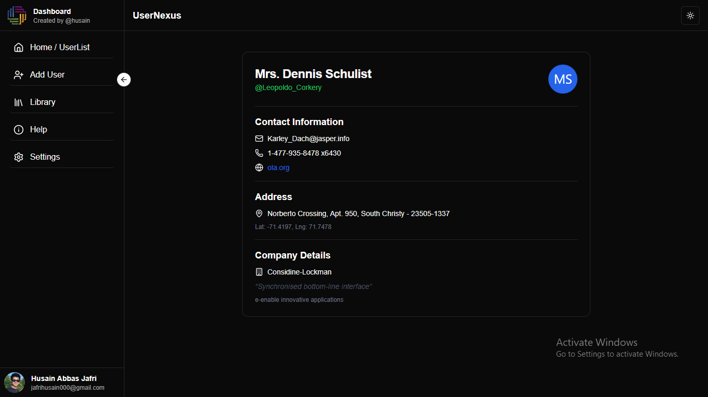
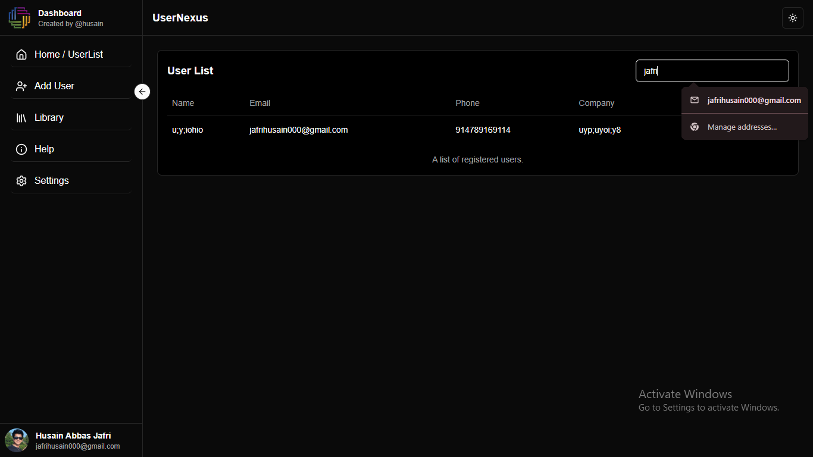
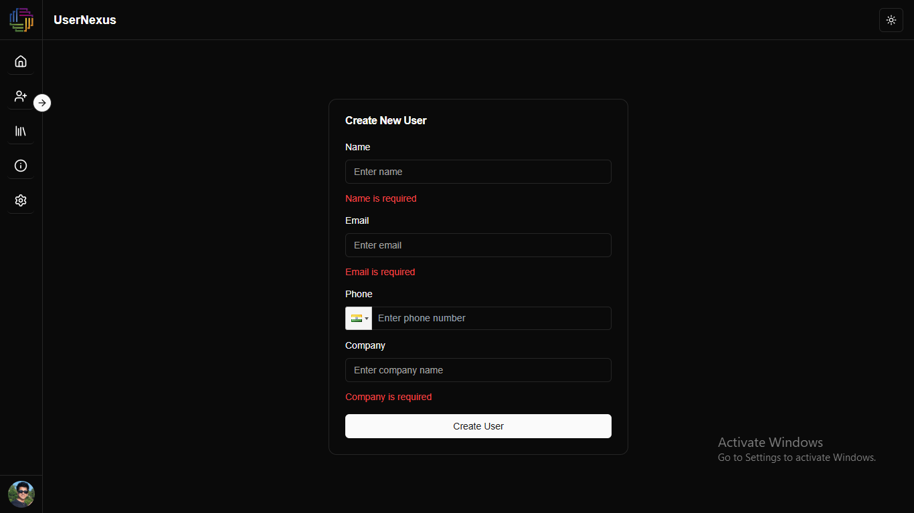
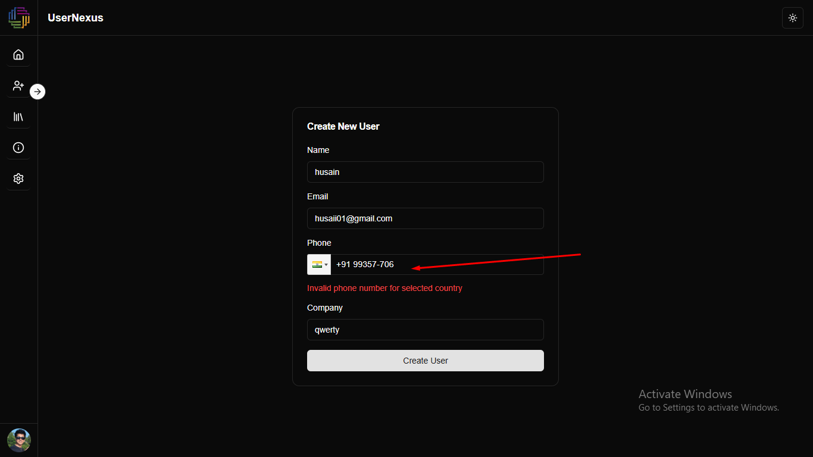
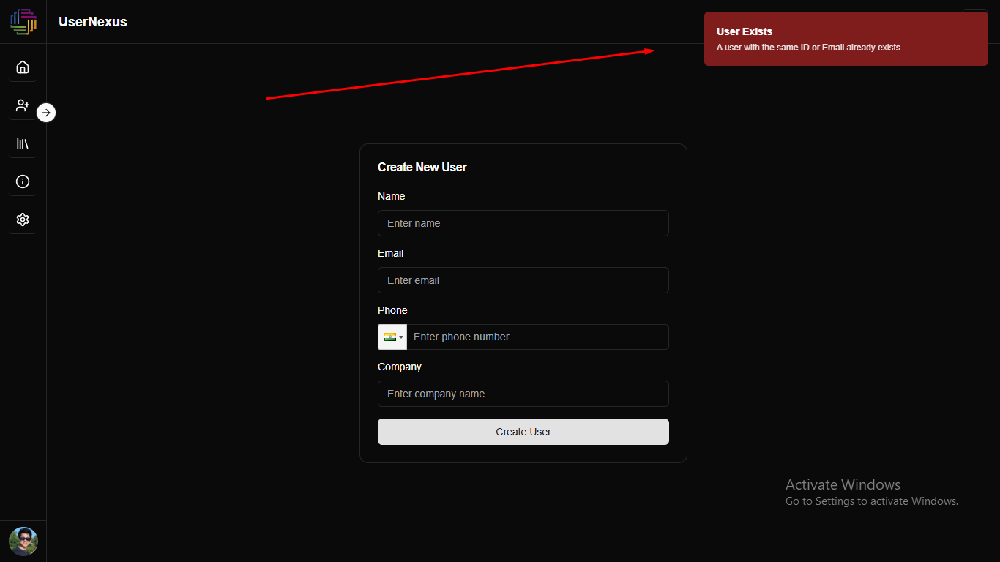
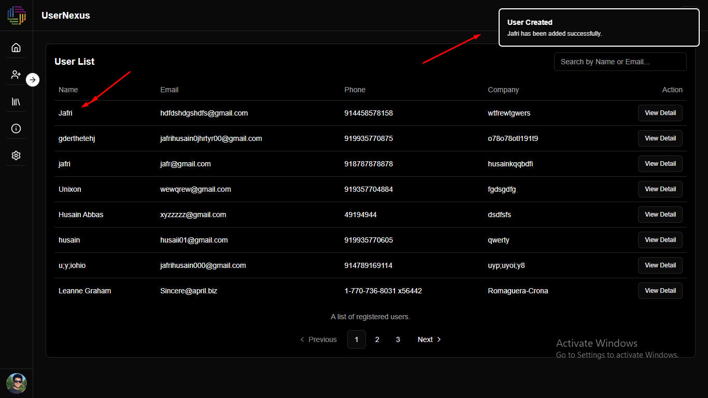
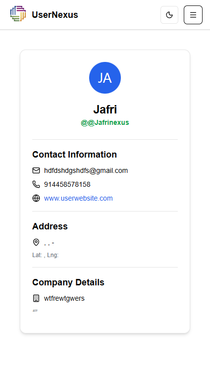
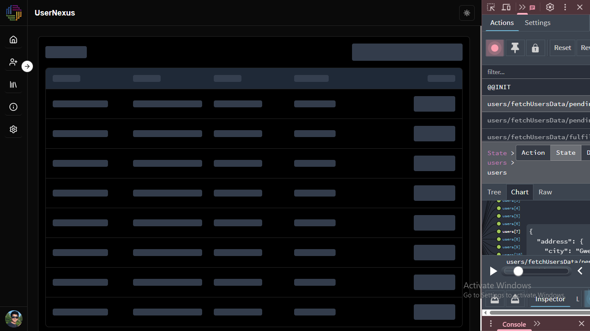

<!-- add .env in root -->
<!-- VITE_API_URL=https://jsonplaceholder.typicode.com -->
<!-- run commands
npm install
npm run dev
 -->